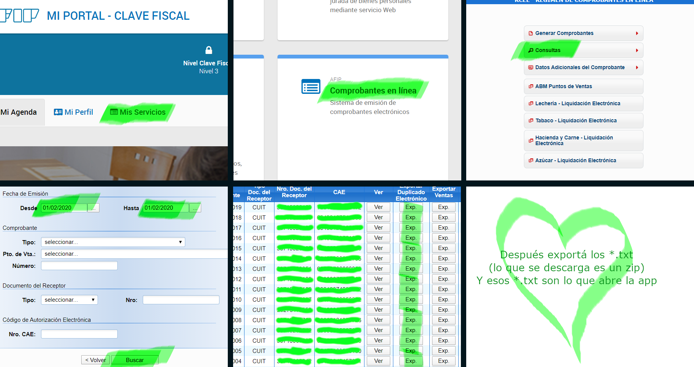

# Visor de Facturas C

**[Probar webapp]**(https://visor-de-facturas-c.web.app/)

Este es un proyecto que me funcionó como excusa para aprender como funca Angular.
Tambien hace un tiempo vengo queriendo hacer alguna herramienta que me ayude facilmente con el tema de AFIP y cuentas y esas cosas. Esto no es la gran cosa, pero que se yo, se ve bonito para mi y es un primer paso para hacer cosas mas interesantes y útiles.
> This project was generated with [Angular CLI](https://github.com/angular/angular-cli) version 8.3.23.

### Servidor local de prueba

Fijate que hay una carpeta dentro del proyecto que se llama *[./src/assets/facturas-de-ejemplo/]*(./src/assets/facturas-de-ejemplo/) y tiene varias facturas exportadas para probar el coso sin tener que exportar las propias de AFIP.
> Run `ng serve` for a dev server. Navigate to `http://localhost:4200/`. The app will automatically reload if you change any of the source files.

>To get more help on the Angular CLI use `ng help` or go check out the [Angular CLI README](https://github.com/angular/angular-cli/blob/master/README.md).

### Exportar las facturas de AFIP

Para exportar las facturas de AFIP hay que seguir estos pasitos
